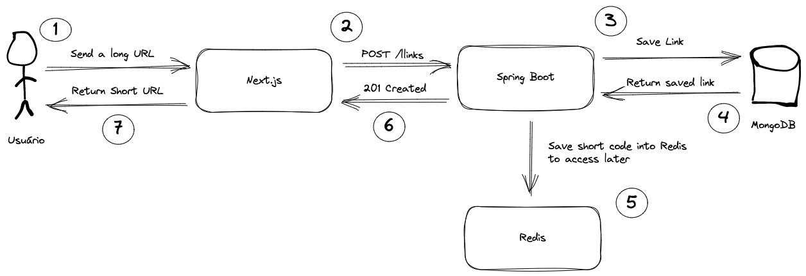

# Esse é o título do seu projeto

Aqui você coloca uma descrição breve sobre o projeto. Uma boa forma de descrever o projeto é falar sobre o que ele é qual problema ele resolve, acrescido de alguns detalhes como: 

- Por quê você decidiu fazer esse projeto?
- Quais foram os desafios de implementá-lo?
- O que você aprendeu com ele?

## Tabela de conteúdos

Aqui você coloca links para acessar mais facilmente cada um dos tópicos do seu README.

Exemplo:

- [Arquitetura](#arquitetura)
- [Features](#features)
- [Instruções de execução](#instruções-de-execução)
- [Contribua com o projeto](#contribua-com-o-projeto)
- [Extra](#extra---adicione-badges)

## Arquitetura

Aqui você disserta sobre a arquitetura que você usou no projeto, que vai desde um desenho que represente a arquitetura usada, como o exemplo abaixo, até mesmo os padrões de projeto que você usou.

Exemplo de texto (explicando a arquitetura do curto.io):

**Next.js**

*Usei Next.js para o frontend devido sua tecnologia server-side, grande parte do projeto precisaria ser gerada no servidor e isso traria grandes vantagens para a aplicação como um todo. Isso, acrescido com a curva de aprendizado baixa por eu já fazer uso dela, me fez tomar a decisão de usá-lo nesse projeto*

**Redis**

*Devido sua característica de KVS (Key Value Store), funciona como uma luva para armazenar os tokens dos links curtos para que possamos posteriormente "trocar" por links longos na aplicação, garantindo rapidez e escala na hora de redirecionarmos os usuários, evitando com que a minha API principal seja bombardeada com tanto tráfego no redirecionamento.*

*Para o redis, estou utilizando Upstash, uma solução que provê o redis como uma plataforma serverless, que vai ser muito legal para o momento da minha aplicação, que vai escalar no decorrer do tempo, além de oferecer um preço muito bacana.*

**Spring Boot**

*É o backend principal da minha aplicação, feita em Kotlin somente pelo motivo de eu já conhecer a linguagem e ter experiência com o ecossistema Java, partir pra esse lado me deu muita produtivdade na hora de codificar os endpoints da API.*

*Apesar de existir a opção de usar as API routes do Next.js, e ser uma ótima opção devido ao incrível serverless da Vercel, para que a aplicação não fique tão cara 🤑 caso ela escale. Unir custo baixo e velocidade no desenvolvimento me deu muita força pra entregar esse projeto.*

## Features

Aqui você descreve as principais features do sistema, de preferência com foto do fluxo da feature ou uma descrição breve do que ela faz.

Exemplo (features do curto.io):

1. Criação de um link curto:

2. Redirecionamento de um link curto para um link longo:

## Instruções de execução

Aqui você descreve brevemente como fazer a instalação das dependências dos projetos, os pré-requisitos para se conseguir fazer isso e como executar a aplicação.

## Contribua com o projeto

Aqui você coloca instruções claras de como contribuir com o projeto, ou você pode colocar um direcionamento à outro arquivo que liste melhor a forma de como contribuir com o projeto.

Exemplo:

Para contribuir com o projeto, veja mais informações em [CONTRIBUTING](./CONTRIBUTING.md)

## Extra - Adicione badges

Adicione badges como essas listadas no projeto [markdown-badges](https://github.com/Ileriayo/markdown-badges) de `Ileriayo`, isso dá um ar de mais profissionalismo, além de deixar tudo mais bonito 😂.